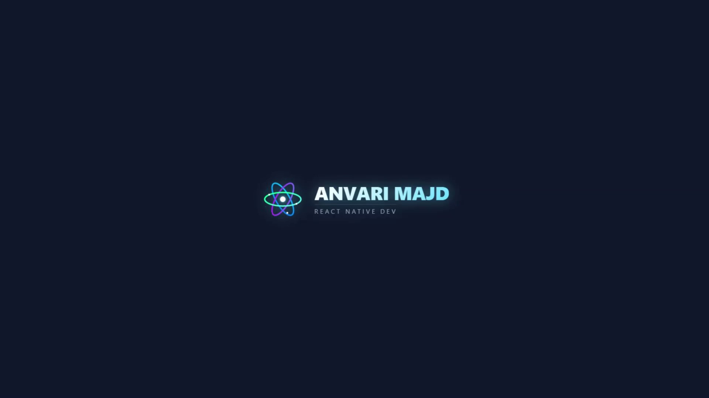

# 🚀 Projects

  

---

## 📂 Projects

| # | Project | Description | GitHub | Program |
|:-:|---------|-------------|:------:|:------:|
| 1 | BMI App | Body Mass Index Calculator built with React Native | [🔗](https://github.com/USERNAME/BMI-App) | React Native |
| 2 | Music Player | Music Player built with Expo & React Native | [🔗](https://github.com/USERNAME/Music-Player) | React Native |
| 3 | Weather App | Weather Forecast Application | [🔗](https://github.com/USERNAME/Weather-App) | React Native |
| 4 | Restaurant App | Restaurant Mobile Application | [🔗](https://github.com/USERNAME/Restaurant-App) | React Native |
| 5 | Shop App | Shopping Mobile Application | [🔗](https://github.com/USERNAME/Shop-App) | React Native |
| 6 | Hospital Network | Cisco Packet Tracer Hospital Network Project | [🔗](https://github.com/USERNAME/Hospital-Network) |
| 7 | Link Page | Modern HTML Link Page | [🔗](https://github.com/USERNAME/Link-Page)       | React Native |
| 8 | ChatHub UI | Modern Chat UI Design | [🔗](https://github.com/USERNAME/ChatHub-UI) | React Native |
| 9 | File Upload UI | Modern File Upload Interface | [🔗](https://github.com/USERNAME/File-Upload-UI) | React Native |

---

## 🛠 Technologies

- React Native
- Expo
- JavaScript
- TypeScript
- HTML5
- CSS3
---

## ⭐ Support

If you like these projects, don't forget to **Star** the repositories! ⭐
