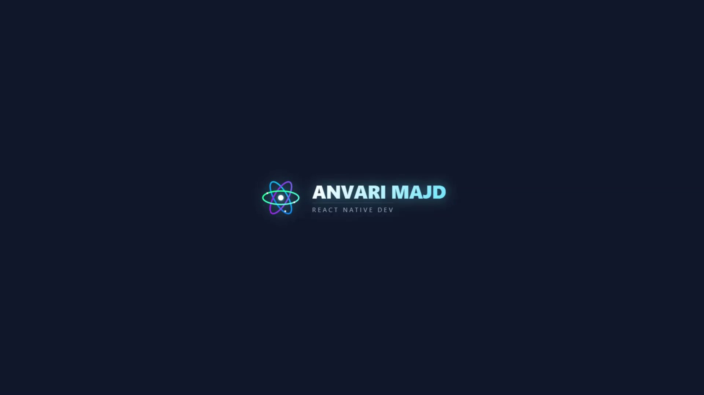

# 🚀 Projects

  

---

## 📂 Projects

| # | Project | Description | GitHub | Technologies | Video |
|---|-------------|---------|------|--------------|------|
| 1 | Dashboard | Modern Dashboard with Flexbox | [🔗](https://github.com/USERNAME/File-Upload-UI) |  React Native, Expo | [🎬](#) |
| 2 | BMI App | Body Mass Index Calculator Mobile Application | [🔗](https://github.com/anvarimajd/BMI-Calculator) | React Native, Expo | [🎬](https://mega.nz/embed/HswxiJrb#5XXhaTN6Owy_dwxfPE9q88wZ7gt5kpvyNJFcauHf-zM) |
| 3 | Music Player | Modern Music Player Mobile Application | [🔗](https://github.com/anvarimajd/Music-Player) | React Native, Expo | [🎬](https://mega.nz/embed/jgYHXa6Y#Fl5s4GE6JfA-ANHVaMN9NIFwRfEmJDOeF66wisnT7Mw) |
| 4 | Crypto App | Cryptocurrency Price Tracking Mobile Application | [🔗](https://github.com/anvarimajd/Crypto_App) | React Native, Expo, API Integration | [🎬](https://mega.nz/embed/24AiFZpT#L8mf1ZFnrnQdgBd_H740pAcF5dTVoFwQ9EsUI9E_kbY) |
| 5 | Weather App |Application with Real-Time Weather Data | [🔗](https://github.com/anvarimajd/Weather-App) | React Native, Expo, API | [🎬](https://mega.nz/embed/Dg5HyTST#a2L4G9F00AvPYLYuhyZrbxwnPvoL92c0xEX968h4SlM) |
| 6 | Binary Game | Interactive Binary Number Learning Game | [🔗](https://github.com/anvarimajd/Binery_Game) | React Native, Expo, Game Logic | [🎬](#) |
| 7 | Restaurant App | Restaurant Menu and Food Ordering | [🔗](https://github.com/anvarimajd/Restaurant-App) | React Native, Expo, UI Design | [🎬](#) |
| 8 | Shop Beginner |  | [🔗](#) | Cisco Packet Tracer, VLAN, Routing, OSPF | [🎬](#) |
| 9 | Shop Inte... | Modern Personal Links Landing Page Website | [🔗](https://github.com/USERNAME/Link-Page) | HTML, CSS, JavaScript | [🎬](#) |
| 10 | Shop Advan... | Modern Chat Application Interface Design | [🔗](https://github.com/USERNAME/ChatHub-UI) | React Native, UI/UX Design | [🎬](#) |
---

## 🛠 Technologies

- React Native
- Expo
- JavaScript
- TypeScript
- HTML5
- CSS3
---

## ⭐ Support

If you like these projects, don't forget to **Star** the repositories! ⭐
